# CSM SERVICE V3 - ไดอะแกรมการทำงาน

อัปเดต: 2026-07-03

ไฟล์นี้สรุปการทำงานของโปรเจคในรูปแบบ Mermaid diagram ภาษาไทย
อ้างอิงจากการตรวจสอบ source code ปัจจุบันของระบบ

## 1. สถาปัตยกรรมภาพรวม

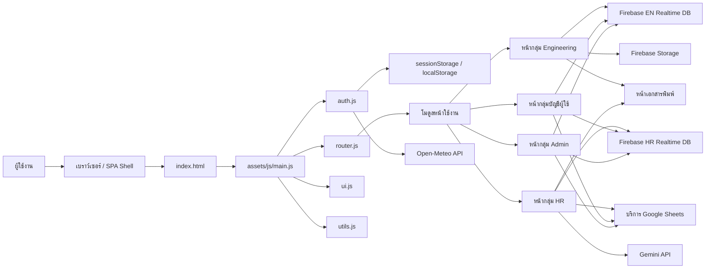

## 2. การเริ่มระบบและการยืนยันตัวตน

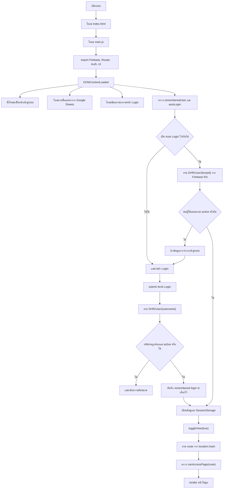

## 3. การทำงานของ Router และการ Render หน้า

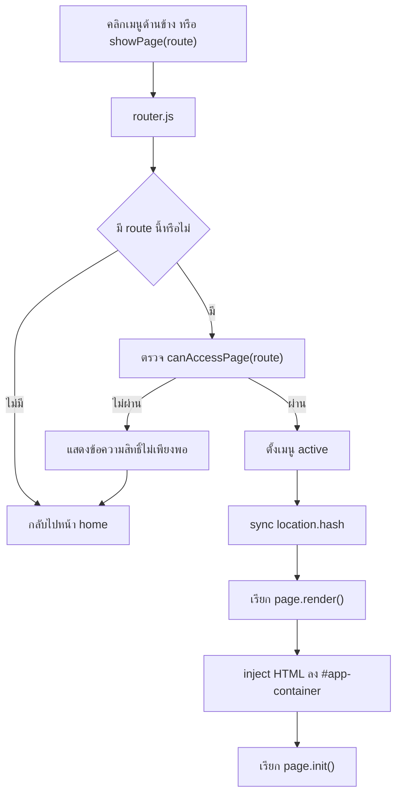

## 4. ขั้นตอนการแจ้งซ่อม Engineering

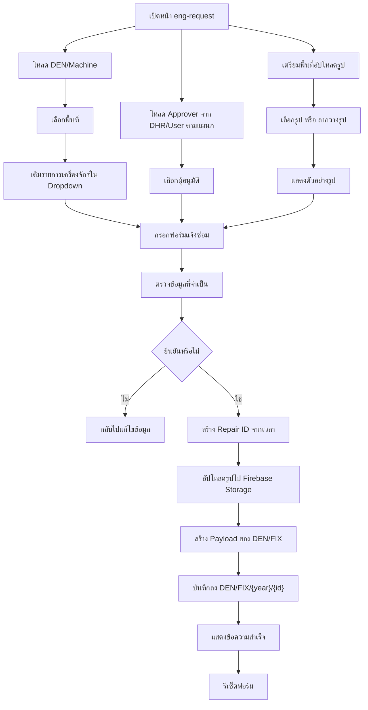

## 5. สถานะงานซ่อม Engineering

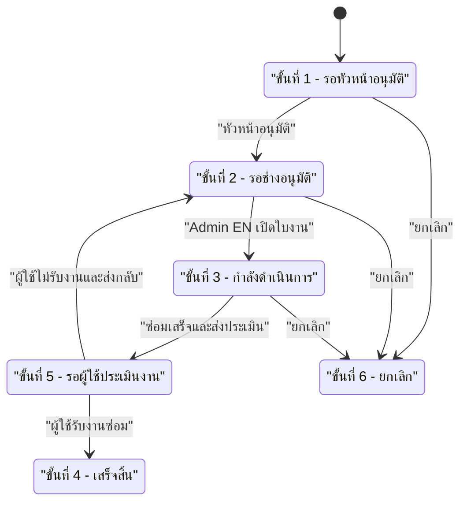

## 6. ขั้นตอนการจองรถและรถรับส่ง HR

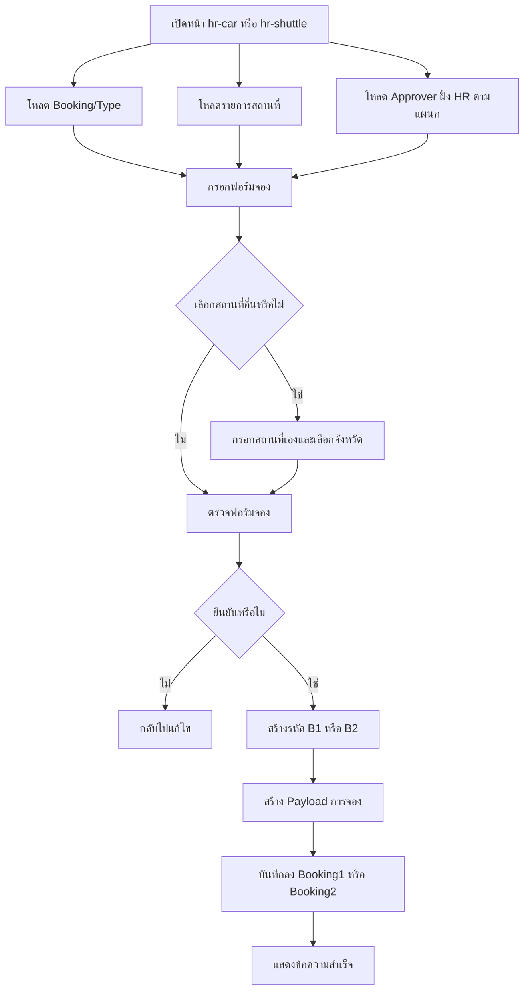

## 7. สถานะงานจองรถ HR

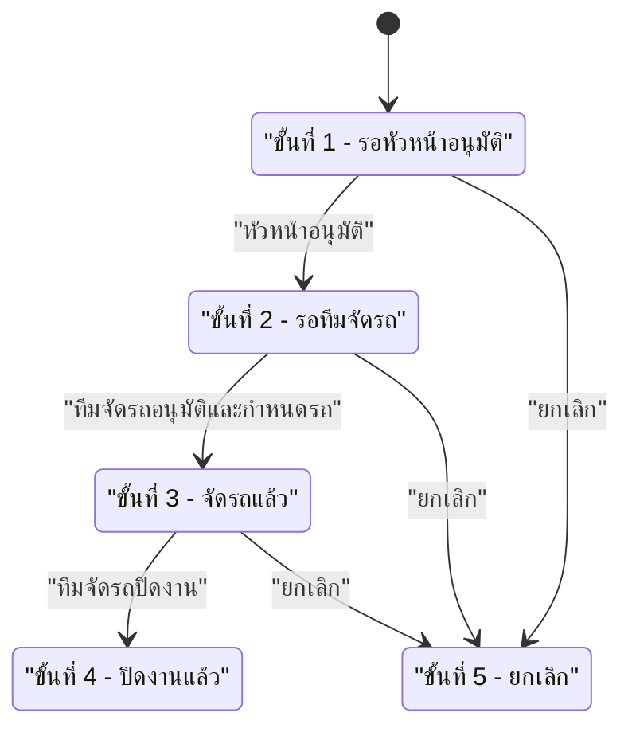

## 8. การจัดกลุ่ม Shuttle HR

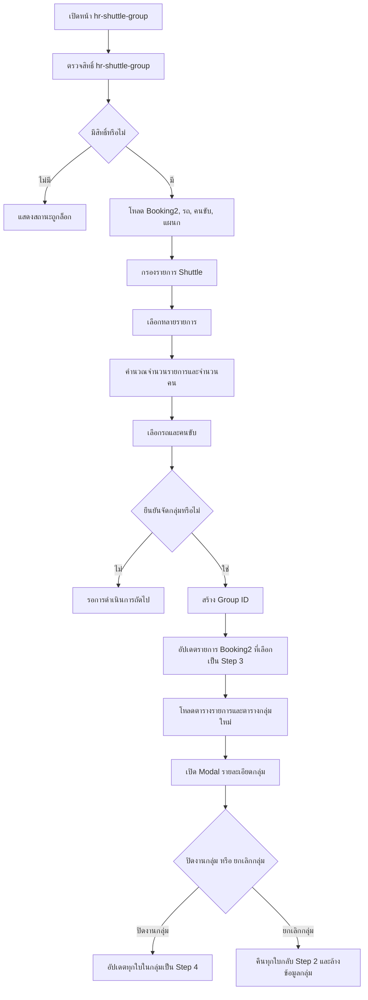

## 9. ขั้นตอนการประเมินผล HR

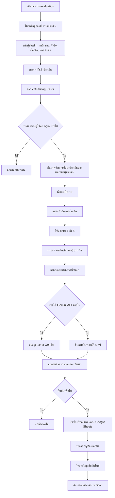

## 10. ขั้นตอนเปลี่ยนเวรและเปลี่ยนกะ HR

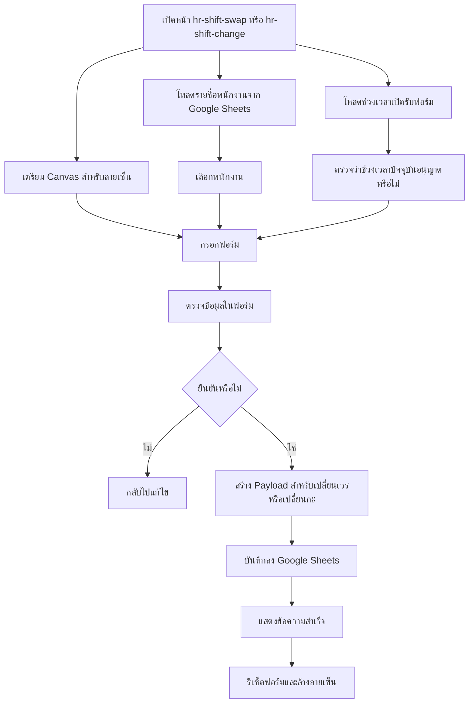

## 11. การ Sync สิทธิ์ผู้ใช้ของ Admin

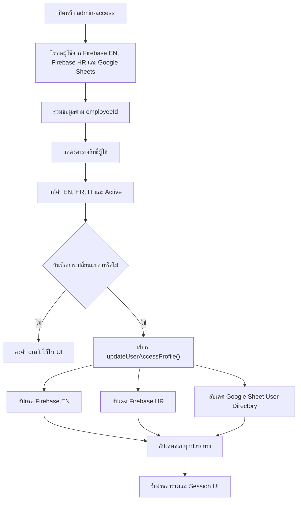

## 12. ขั้นตอนการเปิดเอกสารพิมพ์

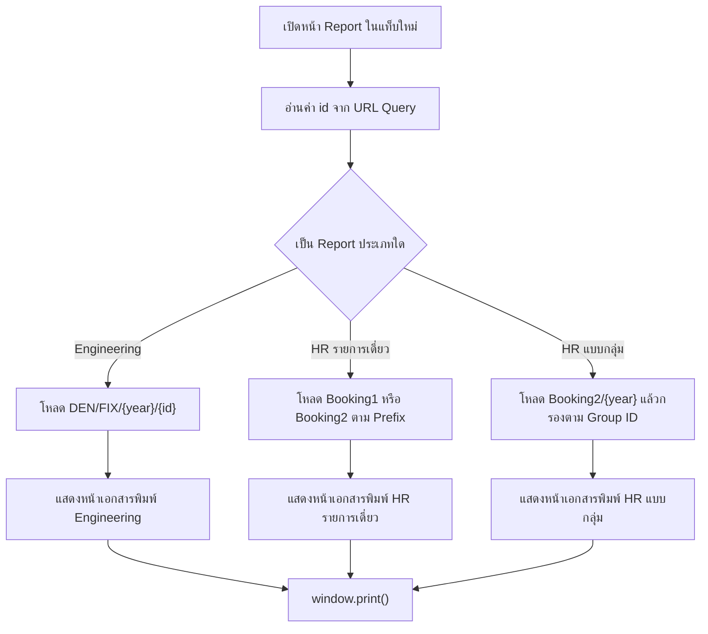

## 13. แผนผังแหล่งข้อมูลหลัก

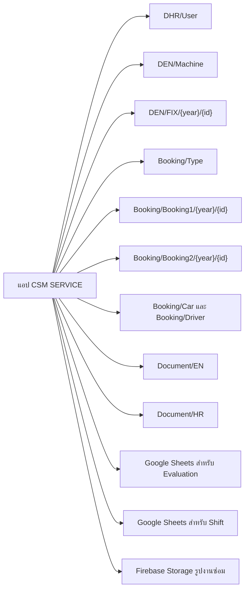

