# CSM SERVICE V3 - Flow Diagrams

อัปเดต: 2026-07-03

ไฟล์นี้สรุปการทำงานของโปรเจคในรูปแบบ Mermaid diagram
อ้างอิงจากการตรวจสอบ source code ปัจจุบันของระบบ

## 1. High-Level Architecture

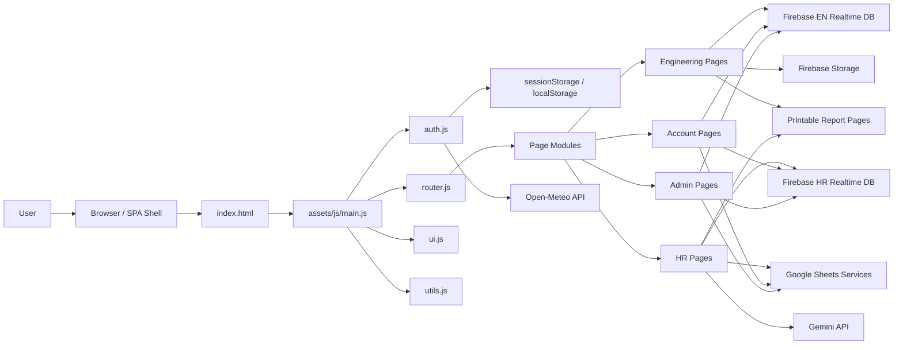

## 2. Startup And Authentication Flow

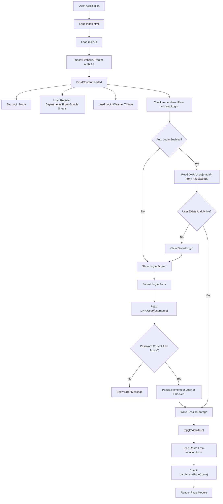

## 3. Router And Page Rendering Flow

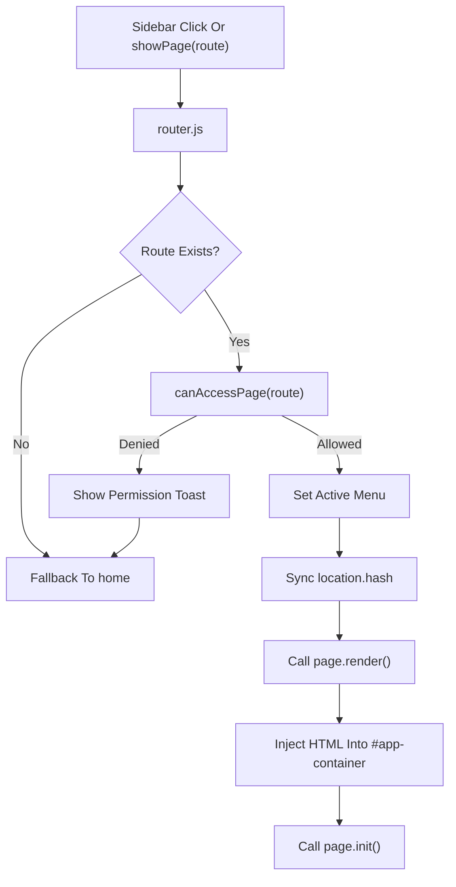

## 4. Engineering Repair Request Flow

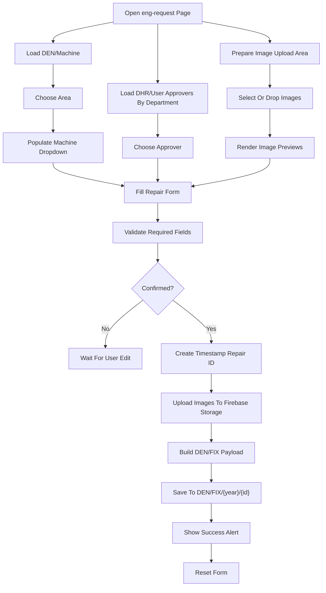

## 5. Engineering Repair State Flow

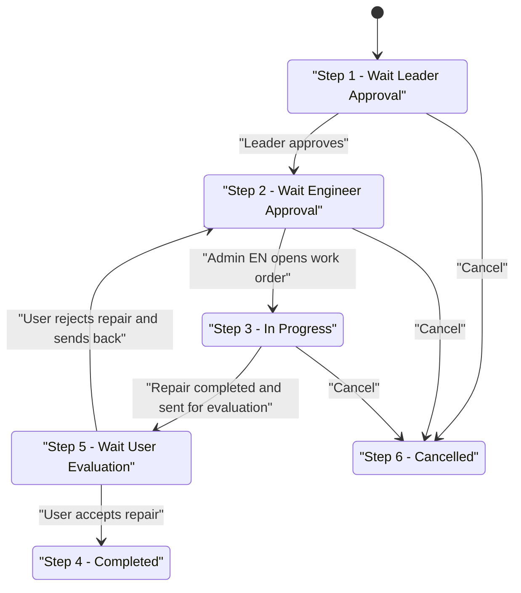

## 6. HR Booking And Shuttle Flow

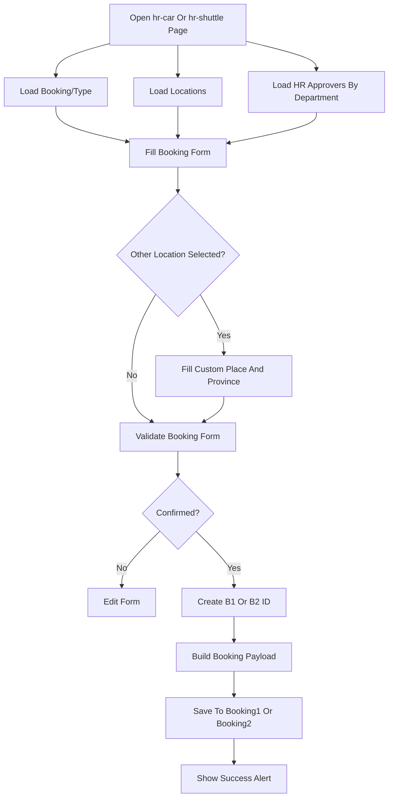

## 7. HR Booking State Flow

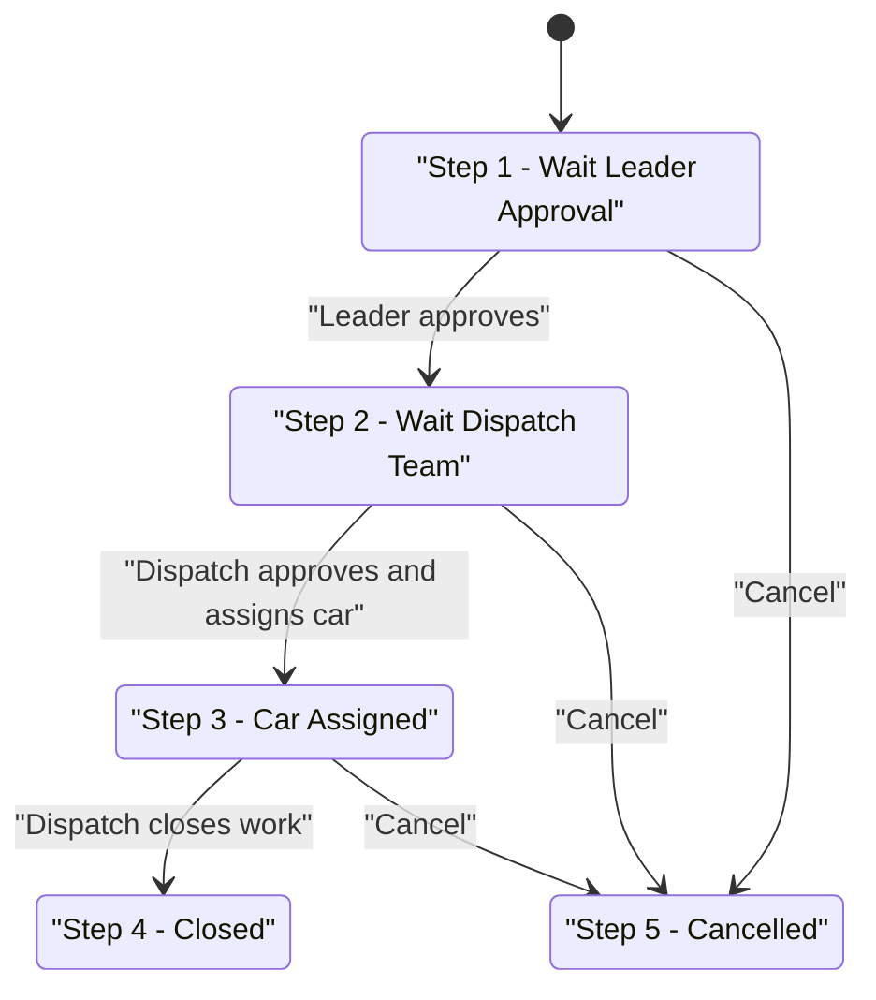

## 8. HR Shuttle Grouping Flow

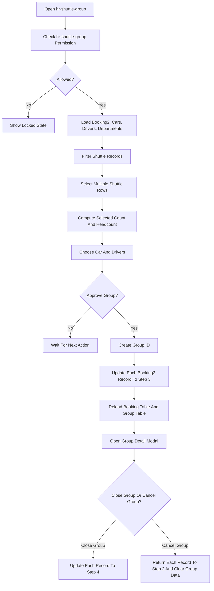

## 9. HR Evaluation Flow

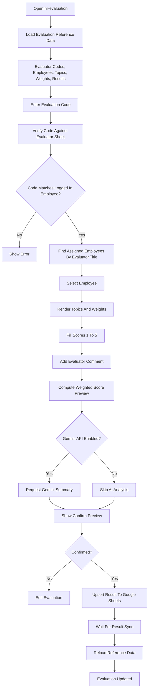

## 10. HR Shift Swap And Shift Change Flow

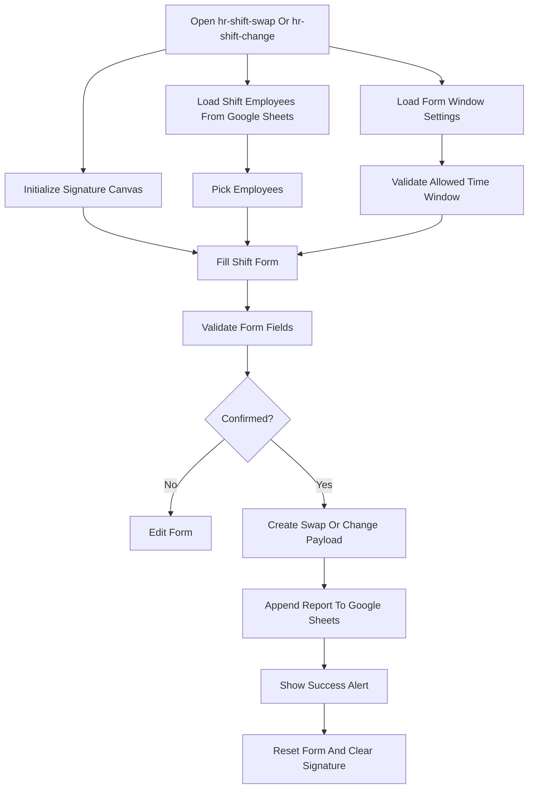

## 11. Admin Account Sync Flow

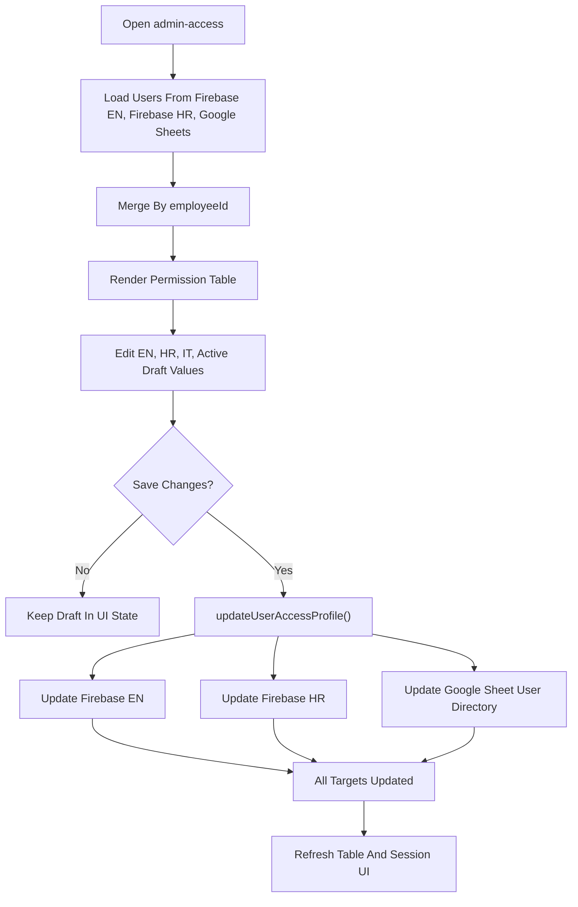

## 12. Printable Report Flow

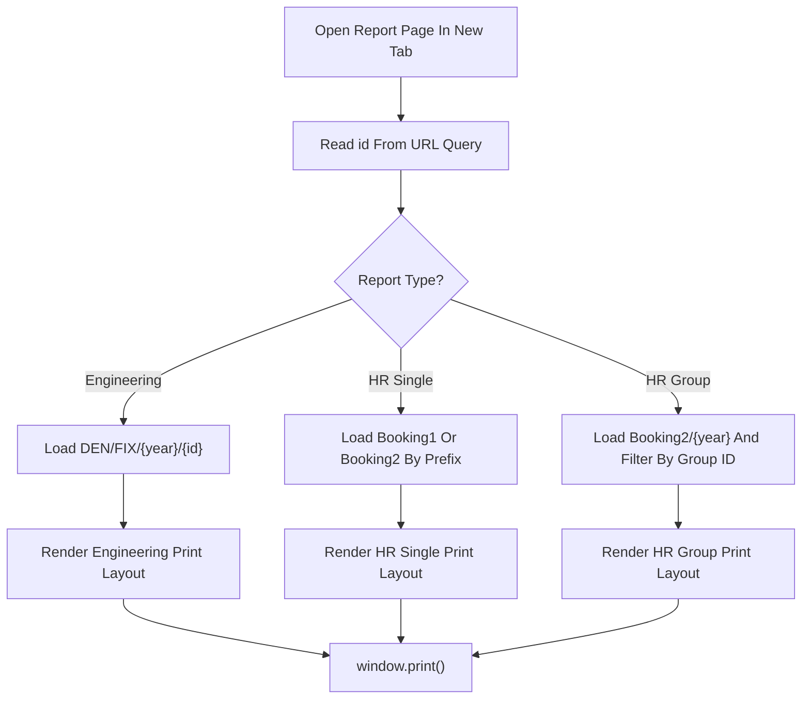

## 13. Main Data Map

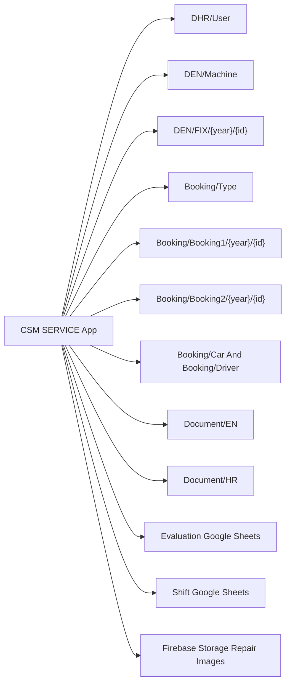
